# UrbanFlora

> Every plant is a chapter.

UrbanFlora is a Flutter app I built for CASA0015 (Mobile Systems &
Interactions, 2025/26). You point your phone at a plant, the app guesses what
it is using the Pl@ntNet API, and you save the result to your personal codex
along with the photo, GPS, weather and a few notes. Streaks and rarity badges
keep you coming back, and a map plus a family-grouped codex let you browse
what you've collected so far. Everything lives in your own Firebase, so the
data is yours.

[Landing page](docs/index.html) · [Storyboard](docs/storyboard.md) ·
[Personas](docs/personas.md) · [User testing plan](docs/user_testing_plan.md)

## Storyboard

<p align="center">
  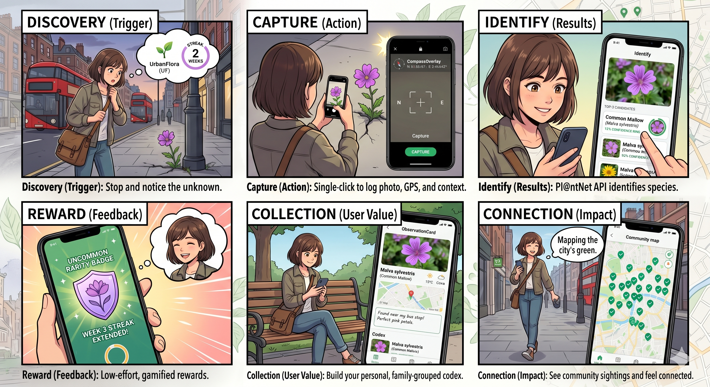
</p>

<p align="center"><sub><i>Concept illustration generated with Google Gemini.</i></sub></p>

## Why

Most people in cities walk past hundreds of plants every day without ever
noticing them. The idea here is to make "noticing" cheap (one shutter press)
and a bit rewarding (a confidence ring, a rarity tier, a streak that survives
if you log at least one plant a week).

## Screens

| Splash | Onboarding (1/3) | Onboarding (2/3) | Onboarding (3/3) |
|---|---|---|---|
| 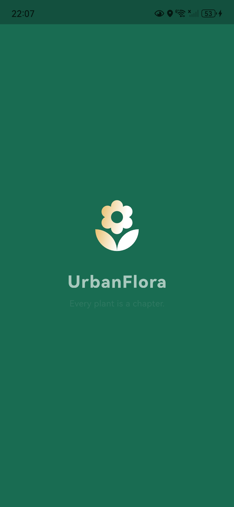 | 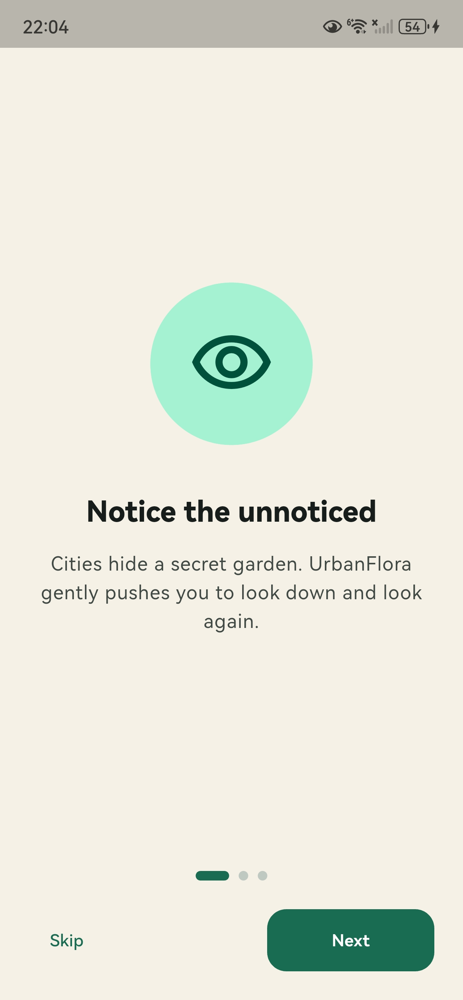 | 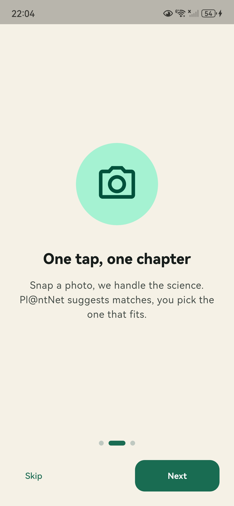 | 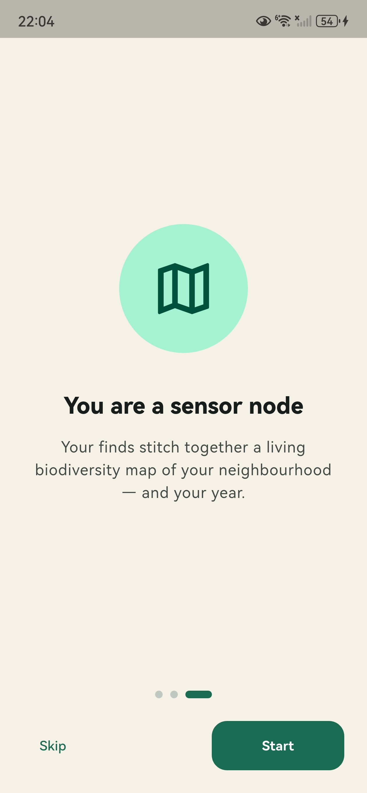 |

| Sign in | Home | Camera | Identify |
|---|---|---|---|
| 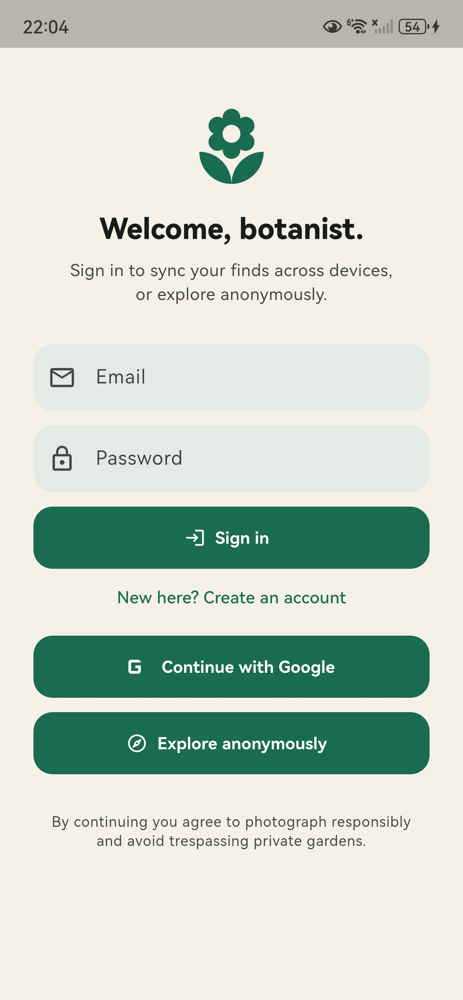 | 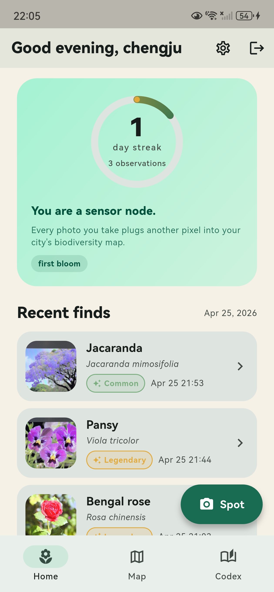 | 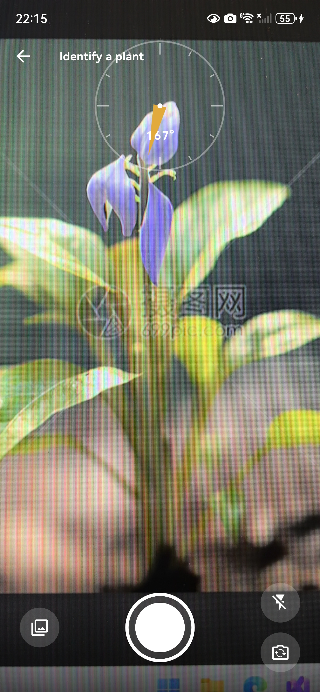 | 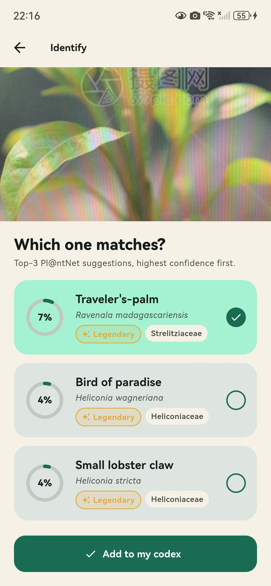 |

| Achievement | Detail | Daily digest | My map |
|---|---|---|---|
| 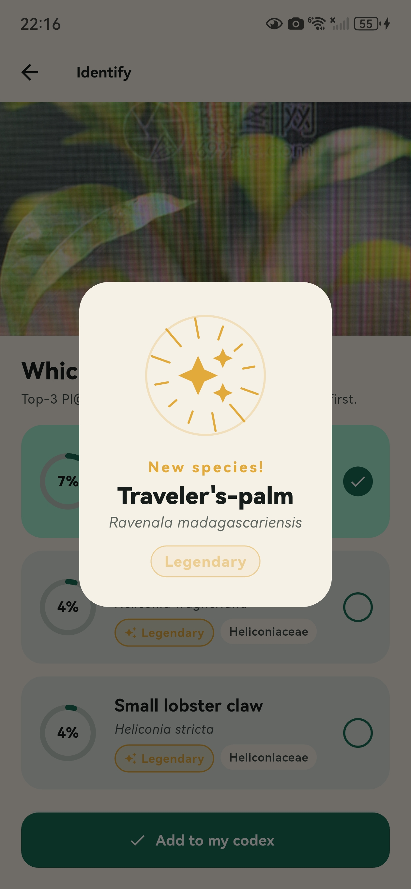 | 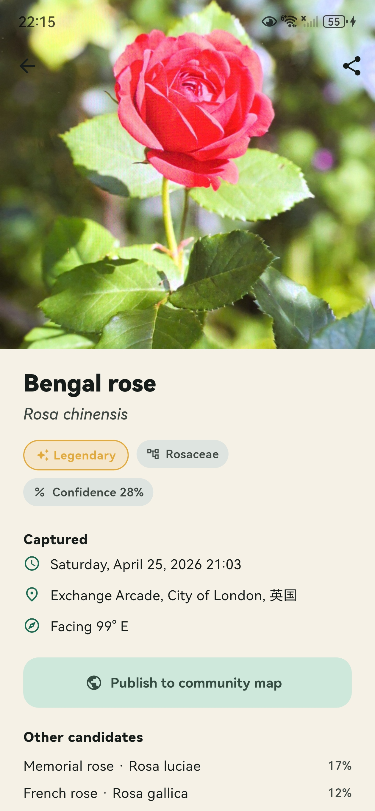 | 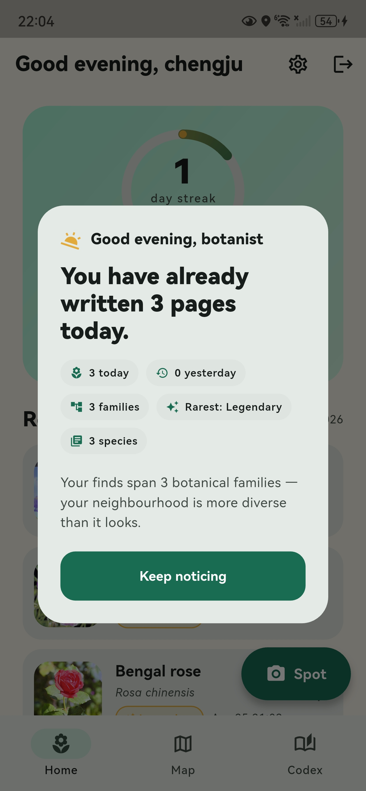 | 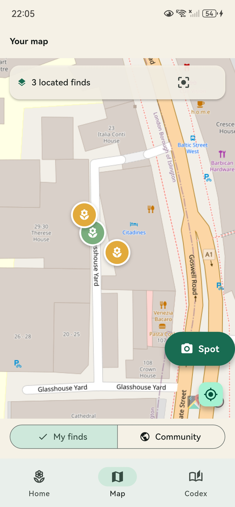 |

| Community map | Codex | Settings |
|---|---|---|
| 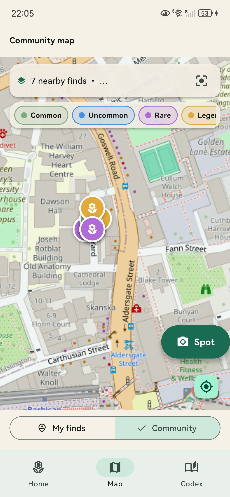 | 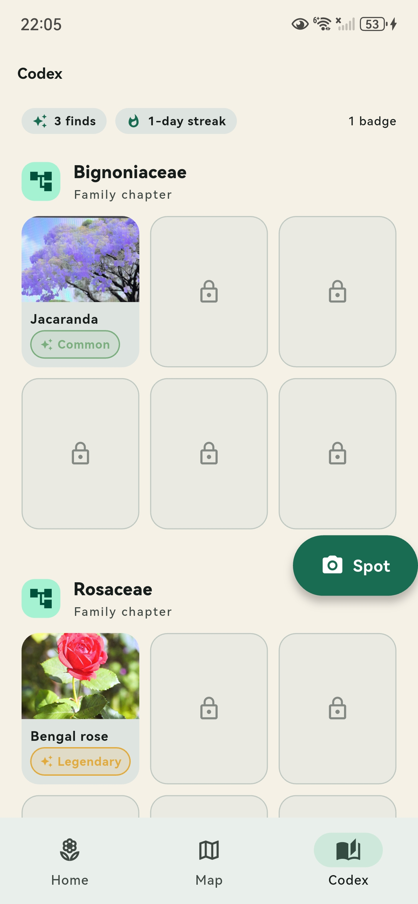 | 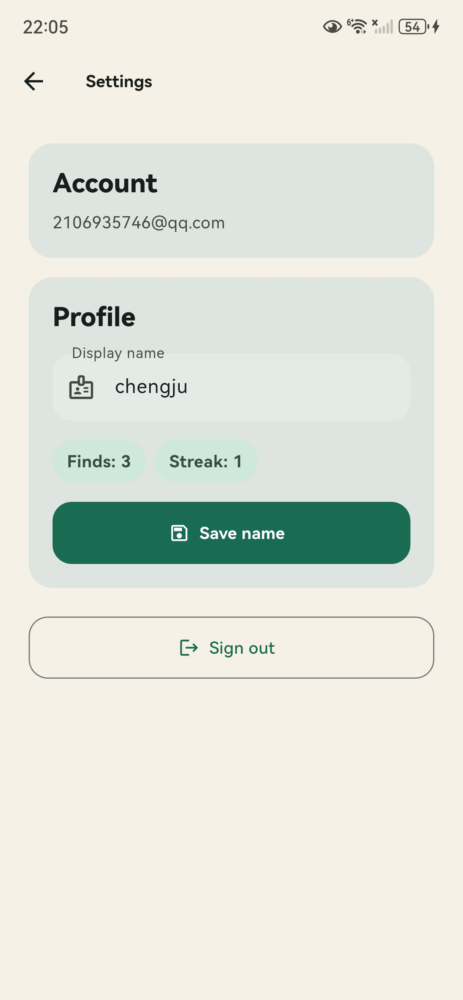 |

## How it's put together

```
Camera + GPS + Compass  ──►  Flutter app (Riverpod + go_router)
                                │
                                ├── Pl@ntNet API
                                ├── OpenWeatherMap
                                ├── Geocoding (reverse address)
                                └── Firebase
                                      ├── Auth (Google or anonymous)
                                      ├── Firestore (profile + observations)
                                      └── Storage (photos)
```

Source layout:

```
lib/
  main.dart                 Firebase init + ProviderScope
  app.dart                  MaterialApp.router + themes
  core/                     theme, router, models, services, constants
  features/                 one folder per screen (splash, onboarding,
                            auth, capture, identification, observation,
                            home, map, codex, shell)
  shared/widgets/           reusable widgets — StreakRing, CompassOverlay,
                            ConfidenceRing, RarityBadge, ObservationCard,
                            AchievementOverlay, ObservationImage
```

## Data model

- `users/{uid}` — nickname, streak counter, total observations, badges.
- `users/{uid}/observations/{obsId}` — photo URL, thumbnail URL, captured-at,
  top-3 candidates, chosen species, lat/lng/address, compass heading, weather
  snapshot, notes.
- `species/{scientificName}` — seed data from
  `assets/seed/species_seed.json`.
- `public_sightings/{obsId}` — opt-in copy of an observation, used by the
  community map. Same fields, but the lat/lng is rounded to 4 decimal places
  (~10 m) so a user's exact garden never gets exposed.

Firestore + Storage rules are in `firestore.rules` and `storage.rules`. Both
lock everything to the user's own subtree, plus a public read on
`public_sightings`.

> Note on Firebase: Cloud Storage needs the **Blaze (pay-as-you-go)** plan.
> The free $300 / 90-day Google Cloud credit is more than enough for a
> coursework demo. If you can't enable Blaze, point `StorageService` at any
> other host — `ObservationImage` already accepts any https URL, local file
> path, or browser blob URL.

## Running it

You'll need:

- Flutter ≥ 3.24, Dart ≥ 3.5
- An Android device / emulator, or iOS 13+ device with Xcode
- A Firebase project (Blaze plan if you want photo upload)
- A Pl@ntNet API key (free, 500 requests/day)
- An OpenWeatherMap key (optional)

```bash
# generate platform folders if they're not already there
flutter create . --project-name urban_flora --org com.urbanflora --platforms=android,ios

# dependencies
flutter pub get

# wire up Firebase
dart pub global activate flutterfire_cli
flutterfire configure

# api keys
cp lib/core/constants/api_keys.dart.example lib/core/constants/api_keys.dart
# then paste your Pl@ntNet + OpenWeatherMap keys

# run it
flutter run
```

### Permissions

Android (`android/app/src/main/AndroidManifest.xml`):

```xml
<uses-permission android:name="android.permission.CAMERA" />
<uses-permission android:name="android.permission.ACCESS_FINE_LOCATION" />
<uses-permission android:name="android.permission.ACCESS_COARSE_LOCATION" />
<uses-permission android:name="android.permission.INTERNET" />
```

iOS (`ios/Runner/Info.plist`):

```xml
<key>NSCameraUsageDescription</key>
<string>UrbanFlora needs the camera to identify plants you photograph.</string>
<key>NSLocationWhenInUseUsageDescription</key>
<string>UrbanFlora uses your location to tag each plant observation.</string>
<key>NSPhotoLibraryUsageDescription</key>
<string>UrbanFlora can pick an existing photo to identify a plant.</string>
```

### Demo mode

If no Pl@ntNet key is set, the app returns three plausible stub candidates so
the flow still demos end to end. If Firebase isn't configured, the cloud-sync
screens show a short explainer instead of crashing.

## Things I'd do with more time

- Cloud Functions to generate real thumbnails — right now `thumbUrl` reuses
  the full URL.
- iNaturalist integration so each species page gets a canonical description.
- Offline-first queue for observations captured without signal.
- A web build, so the codex is browsable on desktop too.

## Licence

MIT. Please attribute Pl@ntNet if you reuse the identification widgets.
